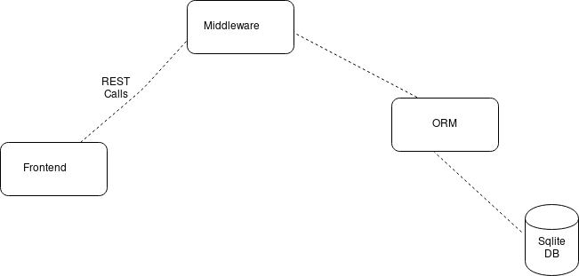

**StackHack**
=============

    Build your way from frontend to backend using Stackhack1.0

**problem statement description**
---------------------------------

Minimum Requirement (entry level)

On Front End:

    Implement a feature to add Tasks.
    Implement a feature to set the due date for these tasks.

On Back end:

    Implement the backend in one of the desired Tech-Stacks provided below.
    Your backend is supposed to store all the tasks data received from the Frontend and store it in the Database.
    You are also supposed to implement a Database in the Backend which should store all this structured data.
    The data sharing between Frontend and Backend should be in JSON format rendered over REST APIs.
    Zip all your Source Code, Screenshots, Deployment Instructions and Upload.

Plus Point (intermediate)

Along with everything asked in Minimum Requirement :

    Implement a feature to set Labels to Tasks like ‘Personal’, ‘Work’, ‘Shopping’ and ‘Others’.
    Implement a feature to set the Status of the Tasks like ‘New’, ‘In progress’ and ‘Completed’.
    You are supposed to implement these features for an End-to-End stack, implementation will go on the Frontend as well as Backend.
    Store the relevant flags in the database.

Extra Work (experienced / wizard)

Along with everything from the above two levels :

    Implement the Signup and Login/Logout functionality. You have to create user-auth schema in the database.
    Implement a feature to Search and Filter Tasks based on Date-time, Priority and Labels, and a combination of at least two or more.

Note : If you complete any or all of the above mentioned levels please do submit.

**Installation**
-----------------

**Prerequisites**
------------------

**using**
--------

    git clone https://github.com/lims-with-autorecommendation/StackHack/
    cd StackHack
    virtualenv venv
    source venv/bin/activate
    pip install -r requirements.txt && pip3 install -r requirements.txt

    run python3 run.py

**Architecture**
----------------

**TODO**
--------

- [ x ] Use flask-restful to interact with REST-API.
- [ ] Improve UI using bootstrap.
- [ ] Add login using google.
- [ ] Come up with an algorithm to sort task on the basis of priority due_date label and status.

**Contributing**
----------------
Pull requests are welcome. For major changes, please open an issue first to discuss what you would like to change.

